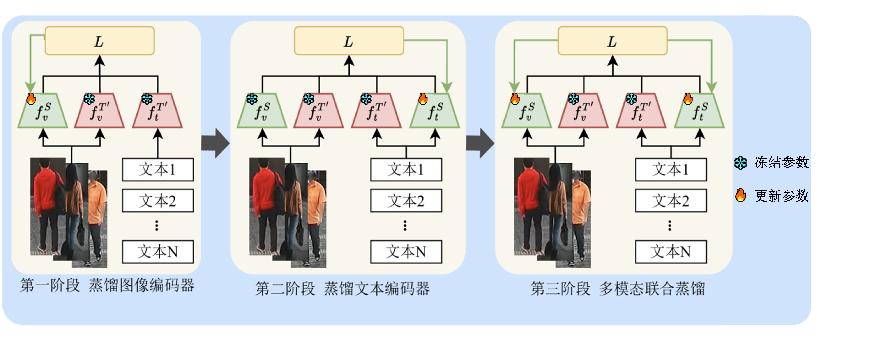

# 基于文图跨模态知识蒸馏的行人检索算法研究

Research on Person Retrieval Algorithm Based on Text-to-Image Cross-Modal Knowledge Distillation

## Updates
- (12/26/2025) Code released!

## Highlights

本文从视觉语言预训练大模型的轻量化角度入手，引入了多模态联合蒸馏与互补式监督策略，基于国产平台，提出了一种基于三阶段渐进式知识蒸馏的文图跨模态行人检索算法。该方法区别于传统两阶段仅对各个模态进行独立蒸馏，而是通过模态内-跨模态的蒸馏路径，依次在图像、文本模态内实现特征对齐，最终在共享隐空间中进行跨模态语义关联的协同蒸馏。




## Usage
### Requirements
服务器：Atlas800	9000  
硬件：  
  CPU：华为鲲鹏920*4  
  NPU：华为昇腾910*8  
软件  
  操作系统：Ubuntu 20.04.6 LTS  
	内核：5.4.0-26-generic  
	驱动：23.00 商业版  
	固件：7.0.0.230 商业版  
	CANN：7.0.0.alpha003  
	Python：3.8.2  
	PyTorch：1.11.0  


### Prepare Datasets
Download the CUHK-PEDES dataset from [here](https://github.com/ShuangLI59/Person-Search-with-Natural-Language-Description), ICFG-PEDES dataset from [here](https://github.com/zifyloo/SSAN) and RSTPReid dataset form [here](https://github.com/NjtechCVLab/RSTPReid-Dataset)

Organize them in `your dataset root dir` folder as follows:
```
|-- your dataset root dir/
|   |-- <CUHK-PEDES>/
|       |-- imgs
|            |-- cam_a
|            |-- cam_b
|            |-- ...
|       |-- reid_raw.json
|
|   |-- <ICFG-PEDES>/
|       |-- imgs
|            |-- test
|            |-- train 
|       |-- ICFG_PEDES.json
|
|   |-- <RSTPReid>/
|       |-- imgs
|       |-- data_captions.json
```


## Training

参考各Markdown文件

## Testing

参考各Markdown文件

## 跨模态蒸馏方法性能对比
#### CUHK-PEDES dataset

|     Method      |  Rank-1   |  Rank-5   |  Rank-10  |    mAP    |
| :-------------: | :-------: | :-------: | :-------: | :-------: |
|  InfoNCE-based  |   50.20   |   73.78   |   82.31   |   46.31   |
| Cross-model KD  |   49.76   |   73.78   |   82.83   |   46.06   |
|     CLIP-KD     |   53.79   |   77.76   |   85.58   |   50.33   |
|    ConaCLIP     |   55.98   |   78.48   |   86.26   |   51.36   |
|    **MoTIS**    |   55.49   |   78.43   |   86.18   |   50.95   |
|    **本 文**    | **59.52** | **81.08** | **87.80** | **54.12** |
|     教师模型     |   73.70   |   89.56   |   93.58   |   66.24   |

#### ICFG-PEDES dataset

|     Method      |  Rank-1   |  Rank-5   |  Rank-10  |    mAP    |
| :--------------:| :--------:| :--------:| :--------:| :--------:|
|  InfoNCE-based  |   36.58   |   59.11   |   69.13   |   19.12   |
| Cross-model KD  |   37.40   |   60.22   |   69.92   |   19.70   |
|     CLIP-KD     |   41.58   |   64.16   |   72.93   |   22.50   |
|    ConaCLIP     |   42.60   |   65.15   |   74.01   |   23.14   |
|    **MoTIS**    |   42.15   |   64.74   |   73.28   |   22.63   |
|    **本 文**    | **47.63** | **69.06** | **76.72** | **25.77** |
|     教师模型     |   63.80   |   80.43   |   85.78   |   38.22   |

#### RSTPReid dataset

|     Method      |  Rank-1   |  Rank-5   |  Rank-10  |    mAP    |
| :--------------:| :--------:| :--------:| :--------:| :--------:|
|  InfoNCE-based  |   34.75   |   62.65   |   74.80   |   27.97   |
| Cross-model KD  |   34.70   |   62.50   |   74.85   |   28.34   |
|     CLIP-KD     |   39.95   |   67.00   |   78.60   |   32.07   |
|    ConaCLIP     |   39.20   |   63.85   |   76.25   |   31.13   |
|    **MoTIS**    |   39.30   |   64.20   |   75.95   |   31.49   |
|    **本 文**    | **42.00** | **68.75** | **79.05** | **33.52** |
|     教师模型     |   59.55   |   82.10   |   88.40   |   47.07   |
[Model & log for datasets](https://pan.baidu.com/s/1hgUYZ_0r170RXAMagLooGw?pwd=4jud)  
提取码: 4jud

## Acknowledgments
Some components of this code implementation are adopted from [IRRA](https://github.com/anosorae/IRRA). We sincerely appreciate for their contributions.

